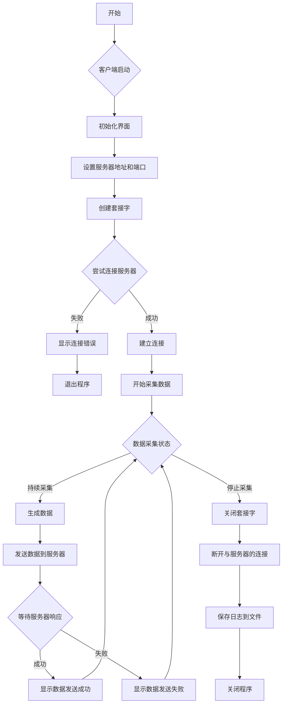
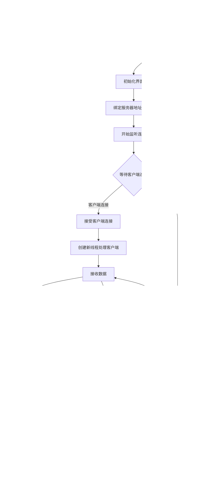
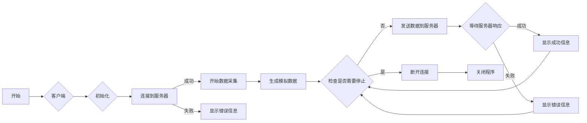
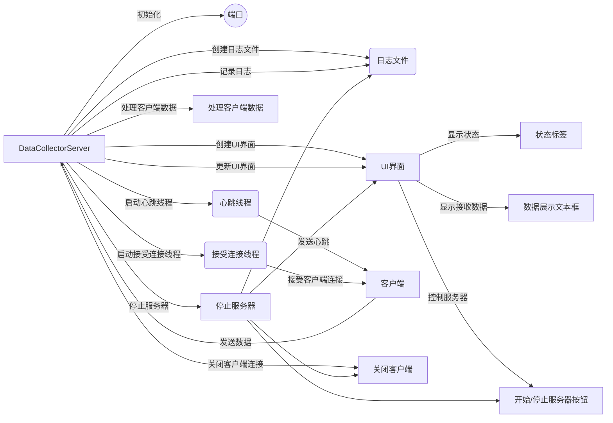

```mermaid
flowchart TD
    A[开始] --> B{客户端启动}
    B --> C[初始化界面]
    C --> D[设置服务器地址和端口]
    D --> E[创建套接字]
    E --> F{尝试连接服务器}
    F -- 成功 --> G[建立连接]
    F -- 失败 --> H[显示连接错误]
    H --> I[退出程序]
    G --> J[开始采集数据]
    J --> K{数据采集状态}
    K -- 持续采集 --> L[生成数据]
    L --> M[发送数据到服务器]
    M --> N{等待服务器响应}
    N -- 成功 --> O[显示数据发送成功]
    N -- 失败 --> P[显示数据发送失败]
    P --> K
    O --> K
    K -- 停止采集 --> Q[关闭套接字]
    Q --> R[断开与服务器的连接]
    R --> S[保存日志到文件]
    S --> T[关闭程序]
```

```mermaid
flowchart TD
    A[开始] --> B{服务端启动}
    B --> C[初始化界面]
    C --> D[绑定服务器地址和端口]
    D --> E[开始监听连接]
    E --> F{等待客户端连接}
    F -- 客户端连接 --> G[接受客户端连接]
    G --> H[创建新线程处理客户端]
    H --> I[接收数据]
    I --> J{检查数据}
    J -- 数据有效 --> K[处理数据]
    J -- 数据无效 --> L[发送错误响应]
    K --> M[发送成功响应]
    I --> N[更新UI显示数据]
    N --> O{客户端是否断开}
    O -- 是 --> P[关闭客户端连接]
    O -- 否 --> I
    P --> Q[等待新客户端连接]
    Q --> F
    L --> O
    M --> O
    B --> R[关闭服务端]
    R --> S[关闭所有套接字]
    S --> T[保存日志到文件]
    T --> U[结束]
```

```mermaid
flowchart LR
    A[开始] --> B{客户端}
    B --> C{初始化}
    C --> D[连接到服务器]
    D -- 成功 --> E[开始数据采集]
    D -- 失败 --> F[显示错误信息]
    E --> G[生成模拟数据]
    G --> H{检查是否需要停止}
    H -- 是 --> I[断开连接]
    H -- 否 --> J[发送数据到服务器]
    J --> K{等待服务器响应}
    K -- 成功 --> L[显示成功信息]
    K -- 失败 --> M[显示错误信息]
    I --> N[关闭程序]
    M --> H
    L --> H
```

```mermaid
flowchart LR
    A[开始] --> B{客户端}
    B --> C{初始化}
    C --> D[连接到服务器]
    D -- 成功 --> E[开始数据采集]
    D -- 失败 --> F[显示错误信息]
    E --> G[生成模拟数据]
    G --> H{检查是否需要停止}
    H -- 是 --> I[断开连接]
    H -- 否 --> J[发送数据到服务器]
    J --> K{等待服务器响应}
    K -- 成功 --> L[显示成功信息]
    K -- 失败 --> M[显示错误信息]
    I --> N[关闭程序]
    M --> H
    L --> H
```

```mermaid
graph LR
    A[DataCollectorServer] -->|初始化| B((端口))
    A -->|创建日志文件| C(日志文件)
    A -->|创建UI界面| D[UI界面]
    A -->|启动心跳线程| E(心跳线程)
    A -->|启动接受连接线程| F(接受连接线程)

    D -->|显示状态| G[状态标签]
    D -->|显示接收数据| H[数据展示文本框]
    D -->|控制服务器| I[开始/停止服务器按钮]

    E -->|发送心跳| J[客户端]
    F -->|接受客户端连接| J

    J -->|发送数据| A
    A -->|处理客户端数据| K[处理客户端数据]

    A -->|记录日志| C
    A -->|更新UI界面| D

    A -->|关闭客户端连接| L[关闭客户端]
    A -->|停止服务器| M[停止服务器]
    M --> C
    M --> D
    M --> I
    M --> L
```